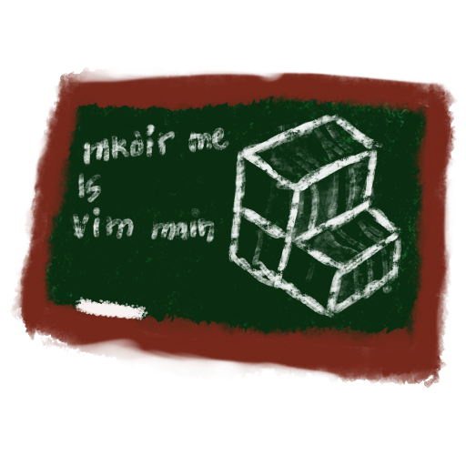
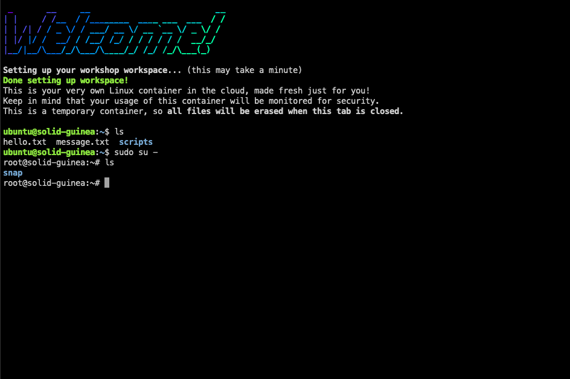

# Container Classroom
A collection of scripts to provide on-demand container sandboxes for classes
and workshops.

## What *exactly* does it do?
Container Classroom provides scripts that orchestrate `lxc`, `ttyd`, and a
couple other programs in order to provide a seamless "type in link, get single-
use container" workflow. This is in service of the original purpose for which
Container Classroom was written, to get workshop goers set up with all the
software they need without installing it locally. This allows a workshop holder
to hit the ground running without having to deal with poor hackathon network
conditions, differences in student workstation configuration, or other tricky
issues.

## How do I run it?
Given that Container Classroom started as a purpose-built kludge meant solely
for my own use, running Container Classroom on your own infrastructure will be
rather technical and rather involved. However, I hope to streamline the
process, so that it is more accessible. That said, the approximate steps are as
follows:

### Step 0. Clone this repo
How else are you going to run these scripts?

### Step 1. Acquire dependencies
Container Classroom currently requires the following software on the host:
- LXD (For creating and orchestrating containers with commands like
  `lxc launch` and `lxc stop`)
- [`ttyd`](https://github.com/tsl0922/ttyd) (For making TTYs for the
  containers available via a web browser)
  - You will want to install `ttyd` to the cloned repo directory, that is
    where the scripts will look for it.
- `figlet` and `lolcat` (For making the cool banners to say "Welcome", these
  packages aren't essential beyond that)
- The Zsh shell (Since I made the interesting choice to write these as zsh)

### Step 2a. Configure LXD network interface
I forget exactly how I did this, but LXD needs to be configured to properly
attach containers to a network interface. Optionally, if you want to have
internet access inside the containers, you will also have to configure
iptables to allow that.

This is probably the most difficult part and as a result the part that I do not
have the best documentation about. This section will hopefully be improved.

### Step 2b. (Optional) Set up a base container image
The Container Classroom scripts will work with base images like `ubuntu;22.04`
and friends, but if you want to pre-distribute files for your workshop and/or
lesson, you will want to make a container with all the files and users you
want and then `lxc publish <container> --alias <image>` it.

### Step 3. Configure the session script
You will want to edit `new_ephemeral_container.zsh` to include your image name,
desired user, and other settings.

### Step 4. Run it!
Executing `start_service.zsh` should launch a tmux session with a log, htop,
and a terminal. This can be safely detached, if you don't need it. To kill
the Container Classroom system, just run `stop_service.zsh`.

## Things I want to add
- [ ] Easier way to get dependencies
- [ ] Better documentation around LXD
- [ ] Move away from using Zsh
- [ ] A web-based control panel

## License Notice
Container Classroom is licensed under the
[Apache License 2.0 license](LICENSE.txt), by Ian Morrill.
